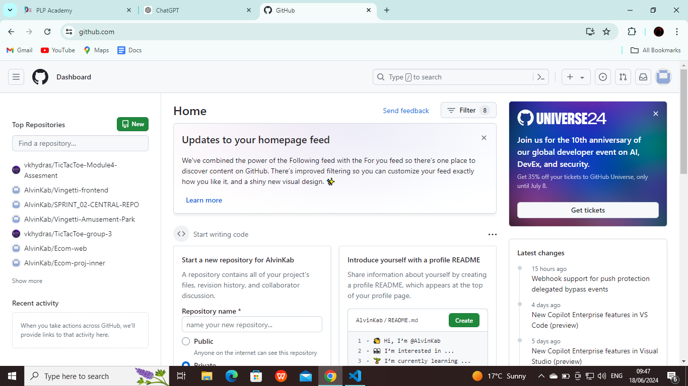

# SE-Assignment-4
Assignment: GitHub and Visual Studio
Instructions:
Answer the following questions based on your understanding of GitHub and Visual Studio. Provide detailed explanations and examples where appropriate.

Important things to note:

Please note that any answers in italics are either fully or partially from ChatGPT.

Questions:
## 1. Introduction to GitHub
**What is GitHub, and what are its primary functions and features? Explain how it supports collaborative software development.**

GitHub is a web-based remote repository hosting service where developers can store, manage and share their code. Its primary features include Git's version control, access control, bug tracking, software feature requests, task management, continuous integration, and wikis for every project.

### *How GitHub supports collaborative development:*
- *Version control with Git: GitHub is built on Git, a distributed version control system. Git allows multiple developers to work on the same project simultaneously without interfering with each other's work.*
- *Pull requests: Pull requests allow developers to propose changes to the codebase.*
- *Issue tracking: GitHub provides an integrated issue tracker to manage bugs, feature requests, and other tasks.*
- *Project management tools: GitHub offers several project management tools to help teams plan and track their work.*
- *Collaboration and communication: GitHub enhances communication among teammembers thorugh markdown support, notification and GitHub discussions.*
- *Access control and permissions: GitHub provides fine-grained access control to manage who can see and modify the repository.*

[Source](https://en.wikipedia.org/wiki/GitHub)

## 2. Repositories on GitHub
**What is a GitHub repository? Describe how to create a new repository and the essential elements that should be included in it.**

A GitHub repository is a centralized location on GitHub where you can store and manage your code, files, and project data.

To create a new GitHub repository, simply navigate to the homepage of your GitHub account, which should look like this:
  
On this part of the homepage, enter the name of the repository you want to create, set its status to either private or public, then click 'Create a new repository'.
  
On clicking 'Create a new repository', you should be directed to the repository you have created, which looks like this:

Essential elements that should be included in your repository are:
- The name of your repository: GitHub does not allow spaces when naming your repository, thus it automatically replaces whitespaces with hyphens.
- The status of your repository: This is whether you want your repository to be private(only you can see and access your repository) or public(anyone can see your repository).
-  A README file: This is to explain how the code in your repo is supposed to be used/ it acts as a guide to your code.

## 3. Version Control with Git
**Explain the concept of version control in the context of Git. How does GitHub enhance version control for developers?**

*Version control is a system that records changes to a file or set of files over time so that you can recall specific versions later. In the context of Git, version control is used to manage and track changes in software projects, allowing multiple developers to work on the same project concurrently without conflicting changes.*

### *Key ways in which GitHub enhances version control for developers:*
- Commit history: GitHub maintains different versions of the repository in case one wishes to revert to a previous version of code. The various commit messages are displayed too so one can determine the various stages that the code in the repository went through.
- *Centralised repository hosting: GitHub provides a centralised location for hosting Git repositories, making it easy for developers to store, manage, and share their code.*
- *Branching and merging: GitHub supports Git's powerful branching and merging capabilities. Developers can create branches to work on features or fixes independently of the main codebase. Once the work is complete, these branches can be merged back into the main branch, facilitating smooth integration of changes.*
- *Pull requests: Pull requests allow developers to ropose changes to the codebase, discuss them with collaborators, and review the changes before merging.*

## 4. Branching and Merging in GitHub
**What are branches in GitHub, and why are they important? Describe the process of creating a branch, making changes, and merging it back into the main branch.**

In GitHub, a branch is a new/different version of the repository in which the branch is in. Branches are important, especially when multiple people are working on said branch, since one can push changes to a subsidiary branch without interfering with the code in the main branch.

To create a new branch, do the following:
Click on the button highlighted in yellow below.

It should take you to a page such as the one below.

Click on 'New branch'.

Name your branch, then click on 'Create new branch'.

To make changes in the branch, use a Git Bash or Powershell terminal and navigate to the directory which is connected to your local and remote repositories.
Run the following commands to change the branch in which your local repository is connected to:  
`git init`  
`git branch -M newbranchname`  
For example, if you named your new branch 'alvin' like I have above, you will run `git branch -M alvin`.
After making changes, push as follows:  y
`git push -u origin newbranchname`

To merge a subsidiary branch into the main branch, one creates a pull request. Once the pull request is created, other members of the repository can review the code, and even merge it based on the repository's settings. If there are merge conflicts, these need to be solved before merging.

## 5. Pull Requests and Code Reviews
**What is a pull request in GitHub, and how does it facilitate code reviews and collaboration? Outline the steps to create and review a pull request.**

A pull request is a proposal to merge a set of changes from one branch into another. In a pull request, collaborators can review and discuss the proposed set of changes before they integrate the changes into the main codebase. Pull requests display the differences between the content in the source branch and the content in the target branch.

Pull requests let you tell others about changes you've pushed to a branch in a repository on GitHub. Once a pull request is opened, you can discuss and review the potential changes with collaborators and add follow-up commits before your changes are merged into the base branch.

### Creating and reviewing a pull request:
- After initializing a pull request, you'll see a review page that shows a high-level overview of the changes between your branch (the compare branch) and the repository's base branch. You can add a summary of the proposed changes, review the changes made by commits, add labels, milestones, and assignees, and @mention individual contributors or teams.
- Once you've created a pull request, you can push commits from your topic branch to add them to your existing pull request. These commits will appear in chronological order within your pull request and the changes will be visible in the "Files changed" tab.
- Other contributors can review your proposed changes, add review comments, contribute to the pull request discussion, and even add commits to the pull request. By default, in public repositories, any user can submit reviews that approve or request changes to a pull request. Organization owners and repository admins can limit who is able to give approving pull request reviews or request changes.
- You can see information about the branch's current deployment status and past deployment activity on the "Conversation" tab.
- After you're happy with the proposed changes, you can merge the pull request. If you're working in a shared repository model, you create a pull request and you, or someone else, will merge your changes from your feature branch into the base branch you specify in your pull request.

[Source](https://docs.github.com/en/pull-requests/collaborating-with-pull-requests/proposing-changes-to-your-work-with-pull-requests/about-pull-requests)

## 6. GitHub Actions
**Explain what GitHub Actions are and how they can be used to automate workflows. Provide an example of a simple CI/CD pipeline using GitHub Actions.**

*GitHub Actions is a powerful feature within GitHub that allows developers to automate workflows directly within their repositories. Workflows can be triggered by various events (such as push, pull requests, or issue creation) and can perform a wide range of tasks, including continuous integration (CI), continuous deployment (CD), and other automated processes.*

### Example of a simple CI/CD pipeline using GitHub actions:

Below is an example of a simple CI/CD pipeline that runs tests and builds a project whenever code is pushed to the repository or a pull request is opened. This example assumes a Node.js project.

    name: CI/CD Pipeline

    # Trigger the workflow on push or pull request events
    on: 
    push:
        branches: [main]
    pull_request:
        branches: [main]

    jobs:
    build:
        runs-on: ubuntu-latest

        steps:
        - name: Checkout code
        uses: actions/checkout@v3

        - name: Set up Node.js
        uses: actions/setup-node@v3
        with:
            node-version: '14'

        - name: Install dependencies
        run: npm install

        - name: Run tests
        run: npm test

        - name: Build project
        run: npm run build

        - name: Deploy to GitHub Pages
        if: github.ref == 'refs/heads/main' && github.event_name == 'push'
        uses: peaceiris/actions-gh-pages@v3
        with:
            github_token: ${{ secrets.GITHUB_TOKEN }}
            publish_dir: ./build

## 7. Introduction to Visual Studio
**What is Visual Studio, and what are its key features? How does it differ from Visual Studio Code?**

Visual Studio is a fully-fledged Integrated Development Environment(IDE) that is utilised to edit, debug and build code. Its key features include default language support for C# and .NET, compilers, code completion tools, and graphical designers.
It is different from Visual Studio Code in that it is a full IDE, whereas VS Code is a rich code editor.
More key differences include:
- Visual Studio is heavy(roughly 40GB for Windows installation), while VS Code is lightweight(roughly 200MB). This means that VS has more features equipped, thus few to no extensions are required, while in VS Code, multiple extenstions are required for various programming languages, including debuggers and IntelliSense.
- Visual Studio comes with default language support for C# and .NET, while VS Code comes with default language support for JavaScript, TypeScript and Node.js.

[Source](https://visualstudio.microsoft.com/)

## 8. Integrating GitHub with Visual Studio
**Describe the steps to integrate a GitHub repository with Visual Studio. How does this integration enhance the development workflow?**

### *Steps to integrate a GitHub repository with Visual Studio:*
- *Install Git and GitHub extensions for Visual Studio.*
- *Sign in to GitHub from Visual Studio.*
- *Clone the GitHub repository.*
- *Open and work with the repository.*

### How this integration enhances development workflow:
- *Seamless version control: Integration with GitHub brings Git’s powerful version control features directly into Visual Studio, allowing developers to manage their source code without leaving the IDE.*
- *Improved collaboration: Developers can easily collaborate with team members by cloning repositories, creating branches for features or fixes, and pushing changes to remote repositories.*
- *Enhanced productivity: By integrating GitHub, developers can focus more on coding and less on managing repositories. Tasks like cloning, committing, pushing, and merging are streamlined.*
- *Unified environment: Developers can work in a single environment where they write code, manage version control, and collaborate with team members. This reduces context switching and increases efficiency.*
- *Real-time feedback and notifications: Integration provides real-time feedback on code changes, pull requests, and issues directly within Visual Studio.*

## 9. Debugging in Visual Studio
**Explain the debugging tools available in Visual Studio. How can developers use these tools to identify and fix issues in their code?**

### Debugging tools available in Visual Studio:
- *Breakpoints: These include conditional breakpoints and function breakpoints. Breakpoints cause the execution of the program, allowing developers to inspect the state of the application at a specific point.*
- *Watch window: This window allows developers to monitor the values of variables and expressions as the program executes.*
- *Locals window: This window displays all the local variables in the current scope and their values. It updates automatically as developers step through the code.*
- *Autos window: The Autos window shows variables that are in the current line of execution and the previous line, providing context-sensitive variable monitoring.*
- *Call stack: The Call Stack window displays the sequence of function calls that led to the current point of execution. This helps developers understand the path taken through the code and trace back to the source of an issue.*
- *Immediate window: This interactive window allows developers to execute code statements and expressions on the fly. It’s useful for testing code snippets and inspecting values during a debugging session.*

### *How developers can use these tools to identify and fix issues:*
- *Setting breakpoints: Developers can start by setting breakpoints at key points in the code where issues might occur. This allows them to pause execution and inspect the state of the application.*
- *Inspecting variables and expressions: Developers can use the Watch, Locals, and Autos windows to monitor the values of variables and expressions.*
- *Tracing the call stack: This involves using the Call Stack window to trace the sequence of function calls.*
- *Executing code in the immediate window: The immediate window can be used to test code snippets, evaluate expressions, and change variables on the go.*

## 10. Collaborative Development using GitHub and Visual Studio
**Discuss how GitHub and Visual Studio can be used together to support collaborative development. Provide a real-world example of a project that benefits from this integration.**

### How GitHub and Visual Studio can be used together to support collaborative development:
- *Git Integration: Visual Studio integrates directly with Git, allowing developers to manage repositories, stage changes, commit, push, and pull updates without leaving the IDE.*
- *Branch Management: Developers can create, switch, merge, and delete branches directly within Visual Studio, supporting parallel development and feature isolation.*
- *Pull Requests: Developers can create and review pull requests (PRs) from within Visual Studio. This facilitates code reviews, discussion, and collaboration on proposed changes.*
- *Inline Comments: Code reviewers can leave inline comments on PRs, providing feedback directly on specific lines of code.*
- *GitHub Actions: GitHub Actions can be configured to run automated tests and deploy code changes. These actions can be triggered by commits and PRs, ensuring code quality and streamlined deployments.*
- *Integrated Build and Release Pipelines: Developers can monitor the status of CI/CD pipelines and view build results within Visual Studio.*

*A real-world example of a project that benefits this integration is a web-based task management tool similar to Trello.*
*The workflow and benefits include:*
- *Repository management.*
- *Feature development.*
- *Code reviews.*
- *Continuous integration.*
